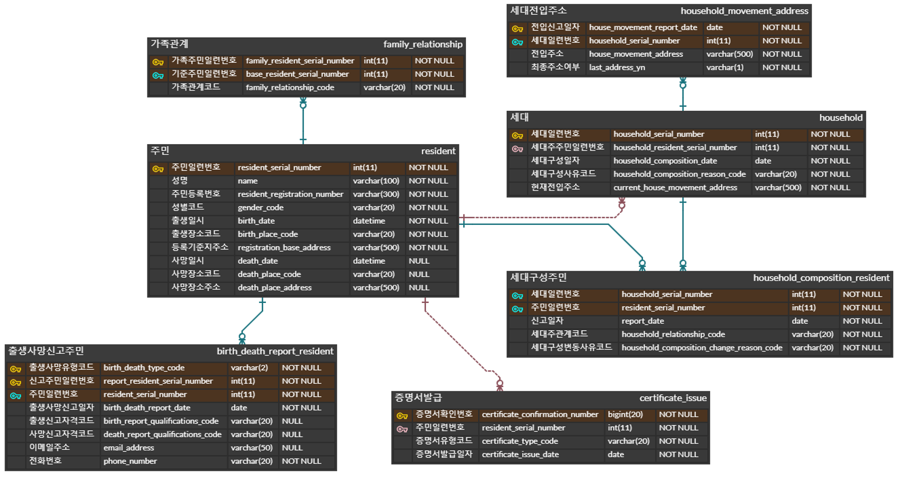

# 학습 목표

지금까지 Spring MVC를 이용하여 게시판을 만들어 보았다. 이번에 학습 할 목표는 다음과 같다.

- View name을 반환했던 Controller를 RestController로 변환
  - RestController란, @Controller에 @ResponseBody가 추가된 것이다. - Json형태의 객체 데이터 반환
- ORM 이해하기
  - `객체지향`언어인 JAVA와, `관계형` DB인 SQL문의 불일치를 중간에서 맵핑해주는 기술
  - 그 기술의 표준 명세인 JPA와
  - JPA의 실제 구현인 Hibernate
- 들을 통해 객체 중심적인 개발을 하여 게시판을 만들어 보자.

## 사용한 기술

- Spring Framework
- Spring Data JPA
- Spring MVC
- Spring Security
- JUnit5 + Mockito + AssertJ



---

# data access layer 구현 - JPA 이용

- Entity 맵핑 - ERD 상에 표현된 컬럼들을 모두 맵핑한다
- 연관관계 맵핑 - ERD 상에 표현된 relation은 모두 맵핑한다
- Repository
    - REST API와 웹페이지를 위한 쿼리들을 Repository로 구현한다
    - 아래 기능들을 모두 이용해서 Repository를 구현해야 한다
        - JpaRepository에 정의된 메서드
        - Spring Data JPA Repository에서 제공하는 메서드 이름 규칙을 이용한 쿼리 생성
        - `@Query`를 이용한 JPQL 수행
        - Querydsl을 이용한 Custom Repository 구현
    - 너무 한 가지 기능에 의존해서 개발한 경우 감점한다
- Dto Project 기능을 최대한 활용한다
- `Pageable` 을 이용해 페이징 기능을 구현해야 한다

# 기반 데이터 입력

- REST API로 구현한다
    - jackson library를 이용해서 JSON으로 요청 및 응답

# **주민 (주민 자체 정보만 등록/수정)**

- 등록 `POST /residents`
- 수정 `PUT /residents/{serialNumber}`

# **가족관계**

- 등록

```
POST /residents/{serialNumber}/relationship     // 여기 `serialNumber`는 기준 주민의 일련번호

{
    "familySerialNumber": 123,                  // 대상 가족의 주민 일련번호
    "relationShip": "father"                    // 부(father),모(mother),배우자(spouse),자녀(child)
}

```

- 수정

```
PUT /residents/{serialNumber}/relationship/{familySerialNumber}

{
    "relationShip": "mother"
}

```

- 삭제

```
DELETE /residents/{serialNumber}/relationship/{familySerialNumber}

```

# **출생 신고**

- 출생신고서 등록 `POST /residents/{serialNumber}/birth`
- 출생신고서 수정 `PUT /residents/{serialNumber}/birth/{targetSerialNumber}`
- 출생신고서 삭제 `DELETE /residents/{serialNumber}/birth/{targetSerialNumber}`

### **cf.)**

- `{serialNumber}` : 행위자의 주민 일련번호
- `{targetSerialNumber}`: 출생한 사람의 주민 일련번호

# **사망 신고**

- 사망신고서 등록 `POST /residents/{serialNumber}/death`
- 사망신고서 수정 `PUT /residents/{serialNumber}/death/{targetSerialNumber}`
- 사망신고서 삭제 `DELETE /residents/{serialNumber}/death/{targetSerialNumber}`

### **cf.)**

- `{serialNumber}` : 행위자의 주민 일련번호
- `{targetSerialNumber}`: 사망한 사람의 주민 일련번호

# **세대**

- 세대 등록 `POST /household`
- 세대 삭제 `DELETE /household/{householdSerialNumber}`

### **cf.)**

- 세대 구성은 복잡하므로 등록과 삭제만 제공한다
- 수정은 삭제 후 등록으로 대신한다

# **세대 전입 주소**

- 세대 전입 주소 등록 `POST /household/{householdSerialNumber}/movement`
- 세대 전입 주소 수정 `PUT /household/{householdSerialNumber}/movement/{reportDate}`
- 세대 전입 주소 삭제 `DELETE /household/{householdSerialNumber}/movement/{reportDate}`

### **cf.)**

- `{reportDate}`
    - 전입신고일자
    - `YYYYMMDD` 형태의 날짜 정보

# 웹페이지

- `Thymeleaf` 를 이용해서 HTML로 응답한다

# **주민 목록**

- 페이징 기능이 제공되어야 한다
- 개별 주민마다 아래 페이지들에 대한 링크를 제공한다
    - 가족관계증명서
    - 주민등록등본
    - 출생신고서 (있는 경우에만 링크 출력)
    - 사망신고서 (있는 경우에만 링크 출력)
    - 증명서 발급 목록
- 개별 주민마다 삭제 버튼을 제공한다

# **가족관계증명서**

# **주민등록등본**

# **출생신고서**

# **사망신고서**

# **증명서 발급 목록**

- 페이징 기능이 제공되어야 한다
- 상세 화면 없이 목록만 제공하면 된다
- 가족관계증명서, 주민등록등본, 출생신고서, 사망신고서 조회 시 증명서 발급 기록

# **주민 삭제**

- 해당 주민에 대한 모든 정보 (주민, 가족관계, 세대, 출생/사망 신고 등)를 삭제한다
- 세대주는 다른 가족이 없는 경우에만 삭제가 가능하다
    - 다른 가족이 있는데 삭제 요청을 한 경우 `남은 가족이 있어 삭제가 불가능합니다` 에러 메시지 출력


---

# Spring security


# 과제 - 주민등록등본, 가족관계증명서, 출생신고서, 사망신고서

- JPA 평가 과제였던 **"주민등록등본, 가족관계증명서, 출생신고서, 사망신고서 - JPA 구현"** 을 기반으로...

# 아이디/비밀번호 인증 추가

# **데이터베이스 테이블 확장**

- 주민 (`resident` 테이블) 에 아래 컬럼을 추가
    - 아이디 (`id`)
    - 비밀번호 (`password`)
    - 이메일 (`email`)
- 비밀번호는 plain text로 저장되면 안 된다
    - 단방향 hash 함수의 digest 기반으로 저장되어야 한다

# **기능 추가**

- 로그인/로그아웃 기능 추가
    - 인증 쿠키는 expire를 3일로 한다
    - 세션은 redis에 저장한다

# **기능 변경**

- 주민 목록
    - 전체 주민 목록이 아니라
        - 로그인한 본인과
        - 본인의 세대에 속하는 주민들 목록이 나와야 한다

# OAuth2 인증 추가

- 아이디/비밀번호 인증과 OAuth2 인증은 동시에 기능이 제공되어야 한다
    - 로그인 시 아이디/비밀번호 인증과 OAuth2 인증 중 한 가지를 사용자가 선택할 수 있어야 한다
- OAuth2 Provider는 **github** 만 제공하면 된다

# **OAuth2 인증 구현**

- Spring Security 라이브러리를 이용하지 않고 github API를 이용해서 직접 구현한다

[https://docs.github.com/en/developers/apps/building-oauth-apps/authorizing-oauth-apps#web-application-flow](https://docs.github.com/en/developers/apps/building-oauth-apps/authorizing-oauth-apps#web-application-flow)

# **OAuth2 인증 처리 방식**

- github에서 인증한 결과 중 `email` 값이 실제 `resident` 테이블에 있는 값이면 그 계정으로 로그인을 시켜준다
    - github에서 인증이 성공했다고 하더라도 `email` 값이 `resident` 테이블에 없는 값이면 로그아웃 시킨다

[https://docs.github.com/en/developers/apps/building-oauth-apps/authorizing-oauth-apps#3-use-the-access-token-to-access-the-api](https://docs.github.com/en/developers/apps/building-oauth-apps/authorizing-oauth-apps#3-use-the-access-token-to-access-the-api)